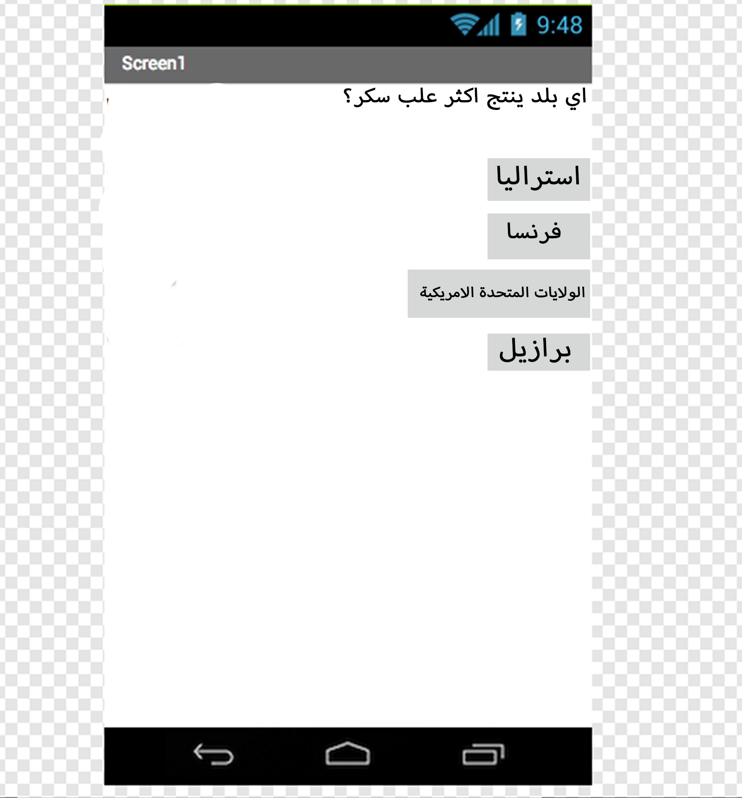

## المقدمة

هذه البطاقات سوف نقدم لك التطبيق المخترع. ستحصل على الفرصة لـ:
 * تعلم كيفية إنشاء تطبيقات لهواتف اندرويد والأجهزة اللوحية
 * أنشئ اختبارًا يحتفظ بالنتائج أثناء اجتياز اللاعب له ، باستخدام أي أسئلة وإجابات تريدها

سأقوم بعمل مسابقة حول إنتاج الغذاء حول العالم. إذا كنت تريد المتابعة معي ، فمرحبا بك. إذا لم يكن الأمر كذلك ، فعندما يكون لدي سؤال حول موضوع إنتاج الغذاء ، يجب عليك طرح سؤالك الخاص والإجابة الصحيحة وبعض الإجابات التي تبدو صحيحة! إذا كنت ستقوم بإجراء اختبار خاص بك ، فكر في الأمر الآن ، وربما قم بتفكير بعض الأفكار مع Ninjas الأخرى في Dojo حول نوع الأسئلة التي يجب أن تكون لديك.

### ما الذي ستصنعه

سينتهي بك الأمر بشيء يشبه هذا (على الرغم من أنه يمكنك اللعب بالألوان وإضافة الصور لتفتيحها إذا أردت).

--- collapse ---
---
title: ما الذي ستتعلمه
---

+ كيفية استخدام App Inventor لإنشاء تطبيقات Android
+ إضافة مكونات إلى الشاشة وتغيير خصائصها
+ إضافة الشاشات وكتابة التعليمات البرمجية للتنقل بينها
+ استخدام الأزرار لتحريك إجراء ما
+ تخزين المعلومات بين الشاشات

--- /collapse ---

--- collapse ---
---
title: ما الذي ستحتاجه
---

### الأجهزة

+ كمبيوتر قادر على الوصول إلى App Inventor

+ اتصال بالإنترنت

**اختياري:**

+ هاتف Android أو الجهاز اللوحي

--- /collapse ---

بمجرد أن تتعلم هذه التقنيات ، يمكنك تطبيقها لإنشاء أكثر من مجرد مسابقة! يمكن استخدام أدوات الترميز نفسها لإنشاء قصة تفاعلية كاملة ، أو لإنشاء آلة حاسبة ، أو مجموعة كاملة من التطبيقات الرائعة الأخرى.