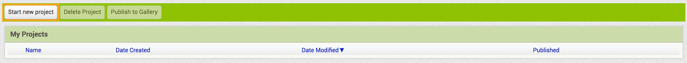
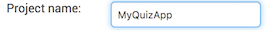
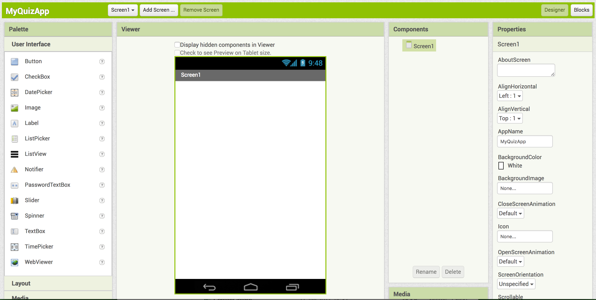

## هيا بنا لنبدأ

قبل أن تتمكن من فعل أي شيء ، ستحتاج إلى حساب على موقع App Inventor.

+ انتقل إلى [dojo.soy/appinv-start](http://dojo.soy/appinv-start){:target="_blank"} ثم انقر على **إنشاء تطبيقات!** زر في الزاوية اليمنى العليا من الشاشة.

سيطلب منك موقع الويب تسجيل الدخول باستخدام حساب Google. إذا لم يكن لديك حساب ، فستحتاج إلى إنشاء حساب أو استخدام حساب والديك / الوصي عليك.

بمجرد تسجيل الدخول باستخدام حساب Google ، يعرض App Inventor خيارات إما لإعداد جهاز Android (هاتف أو جهاز لوحي) أو محاكي (جهاز Android مزيف ومحاكي) على جهاز الكمبيوتر الخاص بك.

--- collapse ---
---
title: ما الخيار الذي يجب علي اختياره؟
---

**قد تحتاج إلى مرشد في Dojo لمساعدتك في هذه الخطوة!**

بناءً على ما لديك أنت أو ما هو متاح في Dojo ، قد تحتاج إلى تثبيت المحاكي ، أو إعداد الجهاز الخاص بك أو جهاز Dojo ، أو عدم القيام بأي شيء على الإطلاق إذا كان Dojo يحتوي بالفعل على أجهزة تم إعدادها.

إذا كنت بحاجة إلى القيام بأي نوع من الإعداد ، فانقر على الرابط المناسب واتبع إرشادات فريق App Inventor. بمجرد الانتهاء من ذلك ، عد إلى بطاقات Sushi.

--- /collapse ---

صحيح! أنت الآن على استعداد للذهاب ، فقد حان الوقت لإنشاء أول تطبيق Android خاصتك.

+ العودة الى التطبيقات المخترع في المتصفح الخاص بك وانقر على **بدء مشروع جديد** زر في أعلى الزاوية اليسرى من الشاشة.

+ سمي مشروعك `MyQuizApp` وانقر فوق **OK**.

سترى شاشة مثل هذه ، مما يعني أنك على استعداد للبدء بالبرمجة!

يمكنك أن ترى أن واجهة التصميم لتطبيق App Inventor مقسم إلى أربعة أقسام رئيسية:
 + **لوحة**، يمكنك منها اختيار المكونات التي ستستخدمها لإنشاء تطبيقك
 + **Viewer**، حيث يمكنك رؤية التطبيق الذي تعمل عليه ، وإعادة ترتيب المكونات وتحديدها
 + **المكونات**، حيث يمكنك رؤية قائمة بالمكونات في تطبيقك وعلاقاتها مع بعضها البعض
 + **خصائص**، حيث يمكنك رؤية وتغيير خصائص المكون الذي حددته في الوقت الحالي

هناك أزرار أخرى وحتى طريقة عرض أخرى ، ولكن هذه الأقسام الأربعة هي ما ستستخدمه الآن.

