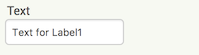
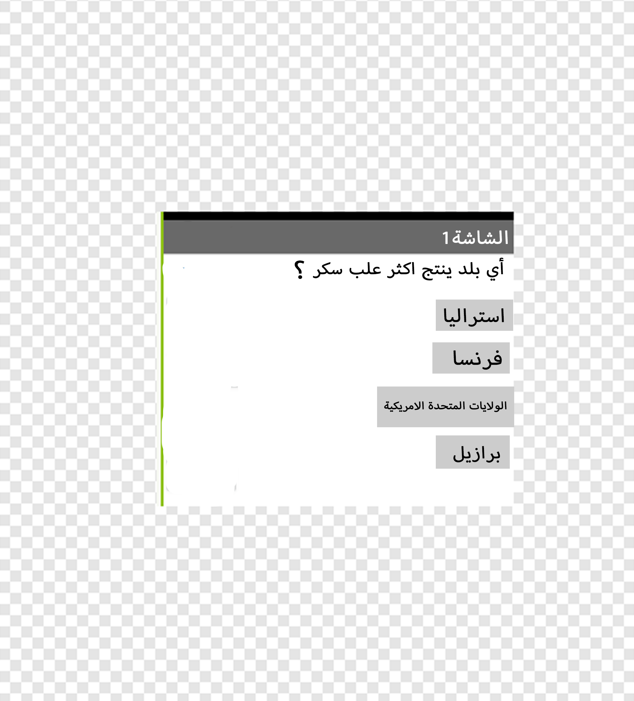

## إنشاء سؤال

+ أولاً ، اسحب مكون **Label** إلى العارض لاستخدامه لسؤالك.

+ لجعل هذا التصنيف يحمل السؤال الذي تريد طرحه فيه ، حدده أولاً بالنقر فوقه إما في قسم "العارض" أو "المكونات".

+ الآن ، في قسم الخصائص ، ابحث عن **نص** (قد تضطر إلى التمرير لأسفل).

+ تغيير النص في مربع النص إلى سؤالك. سأذهب مع "أي بلد ينتج معظم قصب السكر؟" ، لكن يمكنك اختيار أي سؤال تريده.

بالطبع ، ما الفائدة من السؤال إذا كان لدى اللاعب فرصة للإجابة؟ الآن حان دورك لإضافة القليل!

+ سحب أربعة **أزرار** من لوحة إلى عارض، ثم حدد كل منهم، وتغيير نص في قسم خصائص حتى أن واحدا منهم هو الجواب الصحيح والثلاثة الآخرون هم إجابات خاطئة. يمكن ان تجعل إجاباتك صعبة أو مضحكة كما تريد!

نتيجتك النهائية يجب أن تبدو مثل هذا:

الجواب على سؤالي هو البرازيل ، بالمناسبة! يمكنك قراءة المزيد هنا: [dojo.soy/world-sugar](http://dojo.soy/world-sugar){:target="_blank"}
