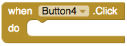
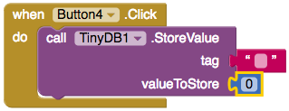
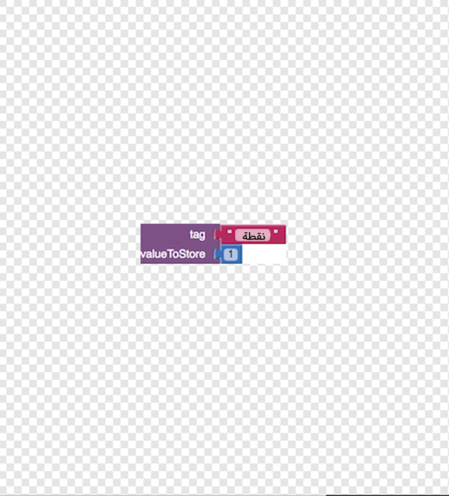

## التحقق من الإجابات

تطبيقات أندرويد مصنوعة من **شاشات**. لقد قمت بإنشاء سؤالك الأول على شاشة واحدة ، وستريد إضافة المزيد. ستضع الأسئلة على شاشات جديدة ، لكنك تحتاج إلى طريقة للحفاظ على النتيجة بين تلك الشاشات. على هذه البطاقة ، ستقوم بإضافة قاعدة بيانات **TinyDB** للحفاظ على النتيجة ، وبعض التعليمات البرمجية لتحديد الإجابة الصحيحة!

+ أولاً ، في قسم لوحة الألوان تحت **Storage**، ابحث عن TinyDB واسحبه إلى مربع العرض. لن ترى أي شيء جديد هناك ، ولكن يجب أن يظهر **TinyDB1** في قسم "المكونات".

الآن حان الوقت للبدء في كتابة التعليمات البرمجية هذا من شأنه أن يعزز اختبارك!

+ في الزاوية العلوية اليمنى من الشاشة ، انقر فوق الزر **Blocks** للوصول إلى مربع عرض Blocks.

تمامًا مثل شاشة Designer السابقة ، تحتوي هذه الشاشة على أقسام: **Blocks** - حيث يمكنك اختيار كتل التعليمات البرمجية **Viewer** - حيث يمكنك سحب كتل التعليمات البرمجية لتجميعها

هناك الكثير من أنواع التعليمات البرمجية - ستحتاج فقط إلى عدد قليل منها في الوقت الحالي.

+ في قسم "الكتل" ، انقر فوق أي زر يطابق الإجابة الصحيحة على سؤالك. بالنسبة لي ، كان **Button4**. تناول كتلة `عند النقر Button4.Click` واسحبه الى نافذة العرض.

+ الآن انقر على TinyDB1 واختر `استدعاء كتلة TinyDB1.StoreValue`. قم بجرها الى الكتلة السابقة ثم انتقل إلى **المدمج في** كتل ونعلق القطع من **الرياضيات** و **نص** لجعلها تبدو مثل هذا:

+ أخيرًا ، قم بتحديث قيمة النص إلى `درجة` والرقم إلى `1`، مثل هذا:

ما قمت به هو تخزين القيمة `1` (كما في نقطة واحدة للحصول على إجابة صحيحة) تحت العلامة `النتيجة` في قاعدة بيانات TinyDB. يمكنك سحبها للخارج وتغييرها على الشاشات اللاحقة. وبهذه الطريقة ، يمكنك الحفاظ على النتيجة في جميع أنحاء التطبيق ، بغض النظر عن عدد الأسئلة التي تضيفها!
