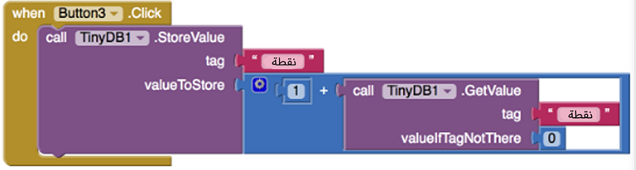
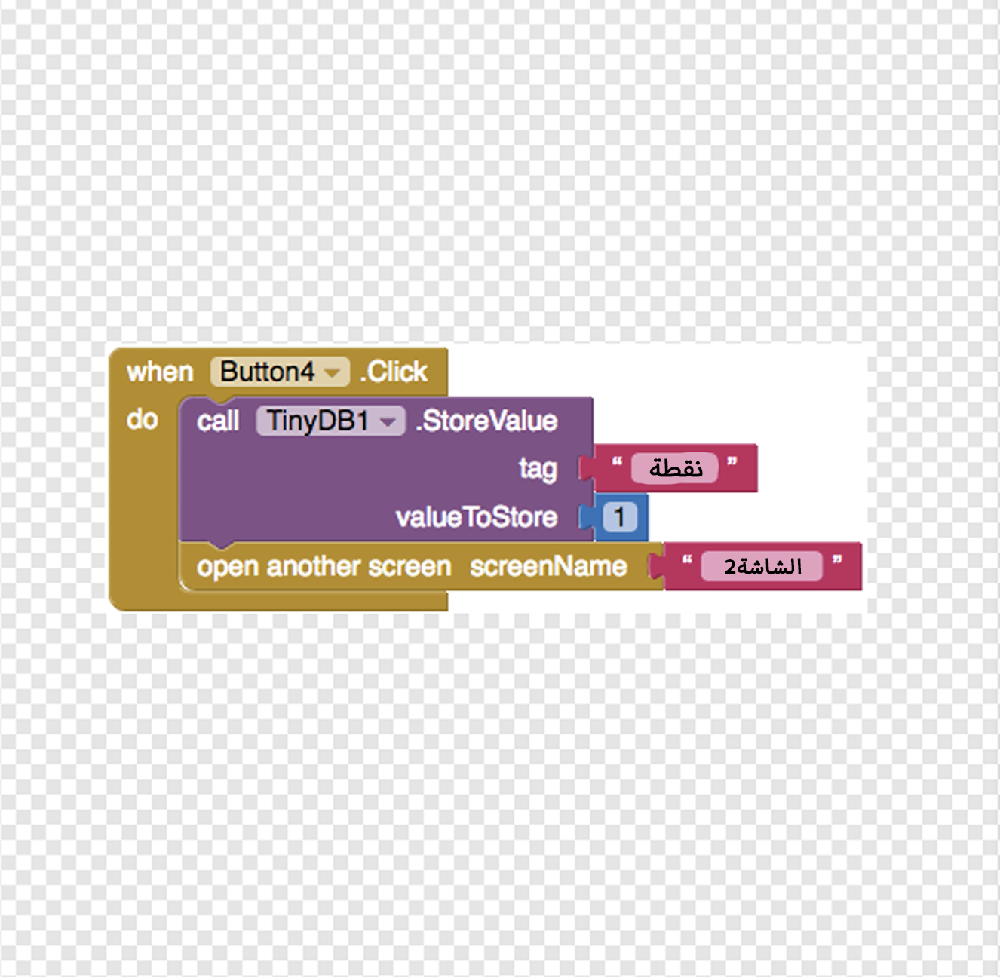
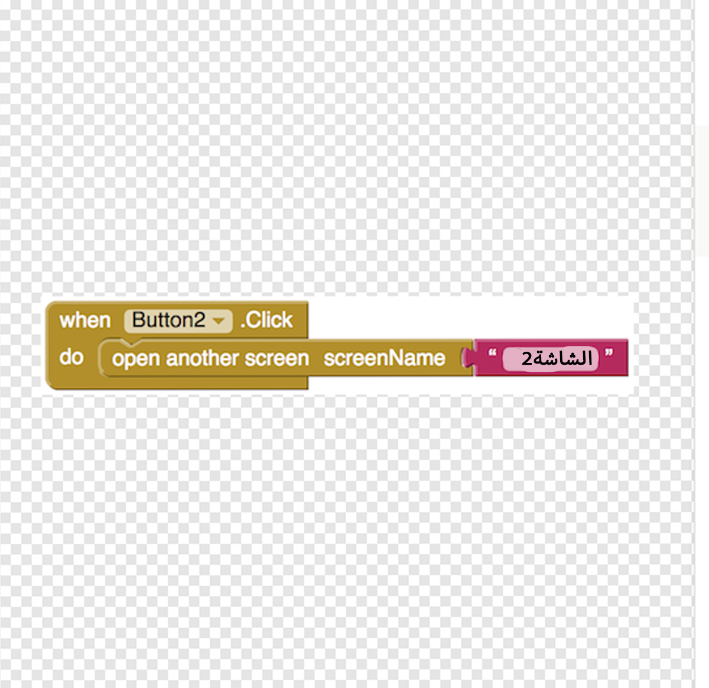

## أسئلة متعددة

الآن لديك سؤالك الأول وأنت تعطي اللاعب نقطة للإجابة الصحيحة.

+ لإضافة سؤال آخر، سوف تحتاج إلى التبديل إلى عرض مصمم وانقر على **إضافة شاشة...** زر في شريط القائمة العلوية.

+ سم شاشتك الجديدة ما تريد. قررت أن تكون مملة وترك الأمر كـ **Screen2** الآن!

+ ستكون شاشتك الجديدة فارغة. أضف ملصقًا بسؤالك التالي وأربعة أزرار مع إجابات ، تمامًا كما في الشاشة الأخيرة. اسحب TinyDB أيضًا ، حتى تتمكن من الحصول على قيمة النتيجة التي قمت بتخزينها! لقد سألت عن البلد الذي ينتج أكبر قدر من الأرز (إنه الهند!) ، لكنك تختار أي شيء يناسب الاختبار الذي تكتبه.

+ أضف بعض التعليمات البرمجية في طريقة العرض Blocks التي تبدو كما يلي. تذكر أن تستخدم الزر الأيمن لإجابتك الصحيحة (كانت إجابتي على Button3) !:

--- collapse ---
---
العنوان: لماذا التعليمات البرمجية مختلفة هذه المرة؟
---

يجب أن يكون رمز تغيير النتيجة أكثر ذكاءً قليلاً هنا ، لأنك حصلت أولاً على **تحصل على** بقيمة `درجة` قبل أن تتمكن من إضافة `1` إليها و **store**.

وبما أنه لن يكون هناك قيمة إلا إذا حصل اللاعب على الإجابة الصحيحة على الشاشة الأخيرة ، فأنت بحاجة إلى تعيين قيمة افتراضية إذا لم يكن هناك شيء هناك.

--- /collapse ---

عظيم! لكن كيف يحصل اللاعبون من Screen1 إلى Screen2؟ تحتاج إلى العودة إلى Screen1 ومنحهم وسيلة!

+ لتبديل الشاشات ، انقر على زر Screen2 واختر Screen1 من القائمة المنسدلة.

+ الآن ، من الكتل المدمجة ، خذ `افتح شاشة أخرى على الشاشة الاسم` **كتلة التحكم** وكتلة نصية ، وأضفها أسفل رمز النتيجة ، مثل هذا (إذا قمت بتغيير اسم الشاشة الخاص بك ، فستحتاج لاستخدام ذلك حيث استخدمت Screen2):

بالطبع ، هذا يعمل فقط إذا تم النقر فوق Button1.

+ تحتاج إلى إضافة كتلة أبسط لجميع الأزرار الأخرى (الإجابات الخاطئة) ، مثل هذا:

من خلال إنشاء المزيد من الشاشات ، وإضافة هذه الأنواع نفسها من الكتل التي تشير إلى الشاشة التالية في كل مرة ، يمكنك إنشاء عدد لا نهائي من الأسئلة ، والحفاظ على النتيجة طوال الوقت!

+ اذهب واصنع واحدة أو شاشتي استفهام أخرى باتباع الخطوات الموجودة على هذه البطاقة.
