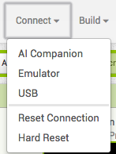
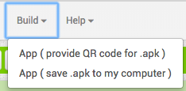

## إنتهيت تقريباً

الآن وبعد الانتهاء من إضافة الأسئلة وتوصيل الشاشات ، تحتاج إلى طريقة لإخبار اللاعب كيف فعلوا ذلك!

+ قم بإنشاء شاشة أخرى واحدة تسمى **ScoreScreen** مع عدم وجود تسمية عليها. تحتاج أيضًا إلى سحب TinyDB حتى تتمكن من الوصول إلى النتيجة.

+ انتقل الآن إلى طريقة العرض Blocks واستخدم الكتل من أقسام **ScoreScreen**و **Label1**و **Text**و **TinyDB1**و **Math** لوضع هذا معًا:

! [] (images / show score.png)

 + أخيرًا ، أضف كتلًا إلى شاشة السؤال الأخير حتى تظهر شاشة النتيجة بعد أن يجيب اللاعب عن السؤال الأخير.

+ يجب أن تكون قادرًا الآن على الانتقال إلى قائمة **Connect** واختيار المحاكي أو أي جهاز اتصال آخر تقوم بإعداده لاختبار تطبيقاتك (قد تحتاج إلى مساعدة موجه خاص هنا!) وشاهد كيف تعمل الشفرة الآن!

--- collapse ---
---
العنوان: كيف يمكنني تثبيت تطبيقي على هاتف أو جهاز لوحي؟
---

+ يمكنك إنشاء تطبيق حقيقي يمكن تثبيته على جهاز Android الخاص بك باستخدام أحد الخيارات من قائمة **Build**. يمكنك إما تنزيل مثبت التطبيق مباشرة ، أو الحصول على رمز الاستجابة السريعة الذي يمكنك مسحه لتنزيل التطبيق على جهازك.

--- /collapse ---

هذا كل شيء! لديك اختبار من شأنه أن يحافظ على النتيجة في جميع صفحاته ، بغض النظر عن العدد الذي تضيفه ، وسوف يخبر اللاعب كيف فعلوا في النهاية. عمل جيد! تحقق من البطاقة التالية للحصول على بعض الأفكار حول ماذا يمكنك أن تفعل مع ما تعرفه الآن!
