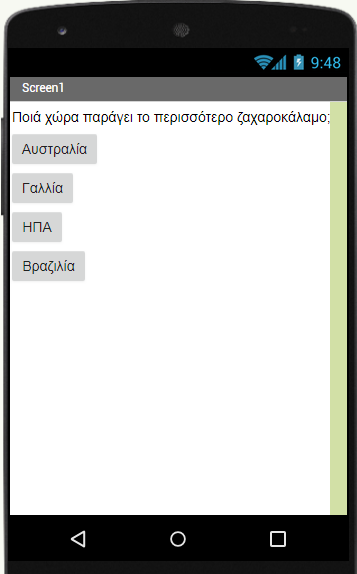

## Εισαγωγή

Αυτές οι κάρτες θα σε εισαγάγουν στο App Inventor. Θα έχεις την την ευκαιρία να:
 * Μάθεις να δημιουργείς εφαρμογές για τηλέφωνα και tablet Android
 * Δημιουργήσεις ένα κουίζ που θα κρατά το σκορ καθώς ο παίκτης θα το συμπληρώνει, χρησιμοποιώντας όποιες ερωτήσεις και απαντήσεις θέλεις

Θα δημιουργήσω το κουίζ μου σχετικά με την παραγωγή τροφίμων σε όλο τον κόσμο. Αν θέλεις να με ακολουθήσεις, είσαι ευπρόσδεκτος. Αν όχι, τότε, όπου έχω μια ερώτηση με θέμα την παραγωγή τροφίμων, θα πρέπει να βρεις τη δική σου ερώτηση, τη σωστή απάντηση και μερικές απαντήσεις που θα φαίνονται σωστές! Αν πρόκειται να φτιάξεις το δικό σου κουίζ, σκέψου το τώρα και ίσως να σκεφτείς κάποιες ιδέες με τους άλλους Νίντζα στο Dojo σου για το τι είδους ερωτήσεις θα πρέπει να έχει.

### Τι θα φτιάξεις

Θα καταλήξεις με κάτι που μοιάζει με αυτό (αν και μπορείς να πειραματιστείς με τα χρώματα και να προσθέσεις εικόνες για να το φωτίσεις, εάν θέλεις).

--- collapse ---
---
title: Τι θα μάθεις
---

+ Πώς να χρησιμοποιείς το App Inventor για να κάνεις εφαρμογές Android
+ Να προσθέτεις στοιχεία στην οθόνη και να αλλάζεις τις ιδιοτήτές τους
+ Να προσθέτεις οθόνες και να γράφεις κώδικα για να μετακινηθείς μεταξύ τους
+ Να χρησιμοποιείς κουμπιά για να ενεργοποιήσεις μια ενέργεια
+ Να αποθηκεύεις πληροφορίες μεταξύ οθονών

--- /collapse ---

--- collapse ---
---
title: Τι θα χρειαστείς
---

### Υλικό (Hardware)

+ Ένας υπολογιστής που έχει πρόσβαση στο App Inventor

+ Σύνδεση στο διαδίκτυο

**Προαιρετικός:**

+ Ένα τηλέφωνο ή tablet Android

--- /collapse ---

Μόλις μάθεις αυτές τις τεχνικές, μπορείς να τις εφαρμόσεις για να δημιουργήσεις κάτι περισσότερο από ένα κουίζ! Αυτά τα εργαλεία κωδικοποίησης μπορούν να χρησιμοποιηθούν για να δημιουργήσουν μια πλήρη διαδραστική ιστορία ή να δημιουργήσουν μια αριθμομηχανή ή μια ολόκληρη δέσμη άλλων απίθανων εφαρμογών.