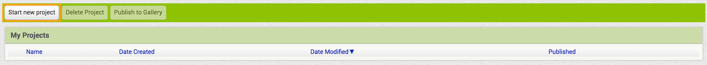

## Ρύθμιση

Προτού  μπορέσεις να κάνεις ο,τιδήποτε, θα χρειαστείς ένα λογαριασμό στον ιστότοπο App Inventor.

+ Πήγαινε στο [dojo.soy/appinv-start](http://dojo.soy/appinv-start){:target="_blank"} και στη συνέχεια κάνε κλικ στο **Create apps!** στην επάνω δεξιά γωνία της οθόνης.

Ο ιστότοπος θα σου ζητήσει να συνδεθείς με έναν λογαριασμό Google. Αν δεν έχεις, πρέπει να δημιουργήσεις ένα ή να χρησιμοποιήσεις το λογαριασμό του γονέα / κηδεμόνα σου.

Μόλις συνδεθείς με έναν λογαριασμό Google, το App Inventor θα σου δείξει επιλογές είτε για τη ρύθμιση μιας συσκευής Android (ενός τηλεφώνου ή tablet) είτε ενός εξομοιωτή (μια ψεύτικη, προσομοιωμένη συσκευή Android) στον υπολογιστή σου.

--- collapse ---
---
τίτλος: Ποια επιλογή πρέπει να επιλέξω;
---

**Μπορεί να χρειαστείς έναν σύμβουλο στο Dojo για να σε βοηθήσει με αυτό το βήμα!**

Ανάλογα με αυτό που έχεις ο ίδιος ή τι είναι διαθέσιμο στο Dojo σου, ίσως χρειαστεί να εγκαταστήσεις τον εξομοιωτή, να ρυθμίσεις τη δική σου συσκευή ή μια συσκευή του Dojo ή να μην κάνεις τίποτα απολύτως εάν το Dojo έχει ήδη εγκαταστήσει συσκευές.

Εάν πρέπει να κάνεις οποιουδήποτε είδους ρύθμιση, κάνε κλικ στον κατάλληλο σύνδεσμο και ακολούθησε τις οδηγίες της ομάδας Inventor App. Αφού το κάνεις αυτό, επέστρεψε στις κάρτες Sushi.

--- /collapse ---

Ωραία! Τώρα είσαι έτοιμος να ξεκινήσεις, ήρθε η ώρα να δημιουργήσεις την πρώτη σου εφαρμογή Android.

+ Επέστρεψε στο App Inventor στο πρόγραμμα περιήγησης σου και κάνε κλικ στο κουμπί **Start new project** στην επάνω αριστερή γωνία της οθόνης.

+ Ονόμασε το έργο σου `MyQuizApp` και κάνε κλικ στο **OK**.

Θα δεις μια οθόνη όπως αυτή, που σημαίνει ότι είσαι έτοιμος να ξεκινήσεις να γράφεις κώδικα!

Μπορείς να δεις ότι η προβολή **Designer** του App Inventor χωρίζεται σε τέσσερα βασικά τμήματα:
 + **Palette**, από την οποία επιλέγεις τα στοιχεία που θα χρησιμοποιήσεις για να δημιουργήσεις την εφαρμογή σου
 + **Viewer**, όπου μπορείς να δεις την εφαρμογή στην οποία εργάζεσαι και να αναδιατάξεις και να επιλέξεις συστατικά
 + **Components**, όπου μπορείς να δεις μια λίστα των στοιχείων της εφαρμογής σου και των σχέσεων μεταξύ τους
 + **Properties**, όπου μπορείς να δεις και να αλλάξεις τις ιδιότητες του στοιχείου που έχεις επιλέξει

Υπάρχουν και άλλα κουμπιά και ακόμη μια προβολή, αλλά αυτά τα τέσσερα τμήματα είναι αυτά που θα χρησιμοποιήσεις προς το παρόν.

