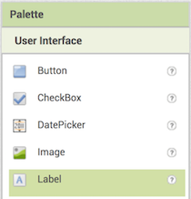

## Δημιουργώντας μια ερώτηση

+ Αρχικά, σύρε ένα στοιχείο **Label** στο Viewer για να το χρησιμοποιήσεις για την ερώτησή σου.

+ Για να κάνεις αυτό το Label να περιέχει την ερώτηση που θέλεις να ρωτήσεις, επίλεξέ το πρώτα κάνοντας κλικ σε αυτό είτε στην ενότητα Viewer είτε στην ενότητα Components.

+ Τώρα, στην ενότητα Properties, αναζήτησε το **Text** (ίσως χρειαστεί να μετακινηθείς προς τα κάτω).

+ Άλλαξε το κείμενο στο πλαίσιο κειμένου με την ερώτησή σου. Εγώ θα βάλω το "Ποια χώρα παράγει το περισσότερο ζαχαροκάλαμο;", αλλά μπορείς να επιλέξεις οποιοδήποτε θέμα σου αρέσει.

Φυσικά, τι εξυπηρετεί ένα ερώτημα αν ο παίκτης δεν έχει την ευκαιρία να απαντήσει; Τώρα ήρθε η ώρα να προσθέσεις μερικές απαντήσεις!

+ Σύρε τέσσερα **Buttons** από την Palette στην ενότητα Viewer και, στη συνέχεια, επίλεξε καθένα από αυτά και άλλαξε την ιδιότητα Text στην ενότητα Properties, έτσι ώστε μία από αυτές να είναι η σωστή απάντηση και οι άλλες τρεις λάθος απαντήσεις. Γίνε όσο δύσκολος ή διασκεδαστικός θέλεις με τις προτεινόμενες απαντήσεις!

Αυτό στο οποίο θα καταλήξεις πρέπει να είναι κάπως έτσι:

Η απάντηση στην ερώτησή μου είναι η Βραζιλία, παρεμπιπτόντως! Μπορείτε να διαβάσετε περισσότερα εδώ: [dojo.soy/world-sugar](http://dojo.soy/world-sugar){: target = "_ blank"}
