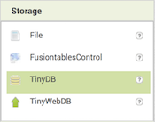

## Έλεγχος απαντήσεων

Οι εφαρμογές Android αποτελούνται από **οθόνες**. Δημιούργησες την πρώτη σου ερώτηση σε μια οθόνη και θα θέλεις να προσθέσεις περισσότερες. Θα θέσεις τις ερωτήσεις σε νέες οθόνες, αλλά χρειάζεσαι έναν τρόπο διατήρησης βαθμολογίας μεταξύ αυτών των οθονών. Σε αυτήν την κάρτα, θα προσθέσεις μια βάση δεδομένων **TinyDB** για να κρατήσεις το σκορ, και κάποιο κώδικα για να σημειώσεις τη σωστή απάντηση!

+ Πρώτον, στην ενότητα Palette κάτω από το **Storage**, βρες το στοιχείο TinyDB και σύρε το μέσα στην ενότητα Viewer. Δεν θα δεις τίποτα νέο εκεί, αλλά το **TinyDB1** πρέπει να εμφανίζεται στην ενότητα Components.

Τώρα είναι καιρός να αρχίσεις να βάζεις τον κώδικα που θα τροφοδοτήσει το κουίζ σου!

+ Στην επάνω δεξιά γωνία της οθόνης, κάνε κλικ στο πλήκτρο **Blocks** για πρόσβαση στην προβολή Blocks.

Ακριβώς όπως στην προηγούμενη οθόνη Designer, αυτή η οθόνη Blocks έχει τα εξής τμήματα: **Blocks** - όπου επιλέγεις μπλοκ κώδικα **Viewer** - όπου σέρνεις τα block σου για να τα συναρμολογήσεις

Υπάρχουν πολλά είδη μπλοκ κώδικα - απλά θα χρειαστείς ορισμένα από αυτά προς το παρόν.

+ Στην ενότητα Blocks, κάνε κλικ σε οποιοδήποτε από τα κουμπιά αντιστοιχεί στη σωστή απάντηση στην ερώτησή σου. Για μένα, ήταν **Button4**. Πιάσε το `When Button4.Click do` μπλοκ και σύρε το επάνω στην ενότητα viewer.

+ Τώρα κάνε κλικ στο TinyDB1 και επίλεξε το `call TinyDB1.StoreValue` μπλοκ. Σύρε το στο τελευταίο μπλοκ και στη συνέχεια πήγαινε στα **Built-in** μπλοκ και κούμπωσε τα κομμάτια από τα **Math** και **Text** ώστε να φαίνονται έτσι:

+ Τέλος, ενημέρωσε την τιμή κειμένου σε `σκορ` και τον αριθμό σε `1`, όπως παρακάτω:

Αυτό που έκανες είναι να αποθηκεύσεις την τιμή `1` (όπως λέμε 1 πόντο για κάθε σωστή απάντηση) κάτω από την ένδειξη `score` στη βάση δεδομένων TinyDB. Μπορείς να το ανακαλείς και να το αλλάζεις στις επόμενες οθόνες. Με αυτόν τον τρόπο, μπορείς να κρατήσεις βαθμολογία σε ολόκληρη την εφαρμογή, ανεξάρτητα από το πόσες ερωτήσεις προσθέτεις!
