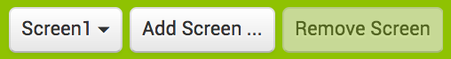
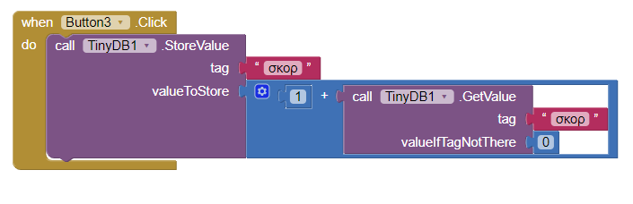
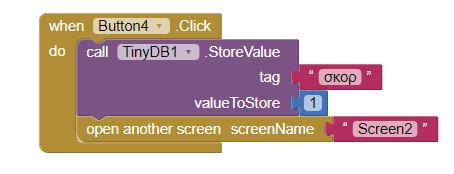
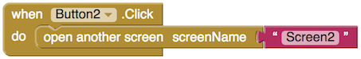

## Πολλές ερωτήσεις

Τώρα έχεις την πρώτη σου ερώτηση και δίνεις στον παίκτη έναν πόντο για τη σωστή απάντηση.

+ Για να προσθέσεις ένα άλλο ερώτημα, θα πρέπει να επιστρέψεις στην προβολή Designer και να κάνεις κλικ στο **Add Screen...** κουμπί στην επάνω γραμμή μενού.

+ Ονόμασε τη νέα οθόνη σου όπως θέλεις. Αποφάσισα να μην πρωτοτυπήσω και την άφησα ως **Screen2** προς το παρόν!

+ Η νέα σου οθόνη θα είναι κενή. Πρόσθεσε ένα Label με την επόμενη ερώτησή σου και τέσσερα Buttons με απαντήσεις, όπως και στην τελευταία οθόνη. Σύρε επίσης ένα TinyDB μέσα, έτσι ώστε να μπορείς να πάρεις εκείνη την τιμή που αποθήκευσες! Έχω ρωτήσει ποια χώρα παράγει το περισσότερο ρύζι (είναι η Ινδία!), Αλλά επιλέγεις ό,τι σου κάνει για το κουίζ που γράφεις.

+ Πρόσθεσε λίγο κώδικα στην προβολή Blocks ώστε να μοιάζει με τα παρακάτω. Θυμήσου να χρησιμοποιήσεις το σωστό Button για την ορθή απάντηση (η δική μου ήταν στο Button3)!:

--- collapse ---
---
title: Γιατί ο κώδικας είναι διαφορετικός αυτή τη φορά;
---

Ο κώδικας για να αλλάξεις το σκορ πρέπει να είναι λίγο πιο έξυπνος εδώ, δεδομένου ότι πρέπει πρώτα να **πάρεις** την τιμή του `score` προτού να προσθέσεις `1` σε αυτό και να το **αποθηκεύσεις**.

Και δεδομένου ότι θα υπάρχει μόνο μια τιμή εκεί εφόσον ο παίκτης δώσει τη σωστή απάντηση στην τελευταία οθόνη, θα πρέπει να ορίσεις μια προεπιλεγμένη τιμή, αν δεν υπάρχει τίποτα εκεί.

--- /collapse ---

Εξαιρετικά! Αλλά πώς περνούν οι παίκτες από την Screen1 στην Screen2; Πρέπει να επιστρέψεις στην Screen1 και να τους δώσεις έναν τρόπο!

+ Για να αλλάξεις οθόνες, κάνε κλικ στο κουμπί Screen2 και επίλεξε Screen1 από το αναπτυσσόμενο μενού.

+ Τώρα, από τα Built-in μπλοκ, πάρε το `open another screen screenName` μπλοκ από την κατηγορία **Control** και ένα μπλοκ Text, και πρόσθεσέ τα κάτω από τον κώδικα βαθμολογίας, κάπως έτσι (εάν έχεις αλλάξει το όνομα της οθόνης σου, θα χρειαστεί να το βάλεις εκεί που εγώ χρησιμοποίησα το όνομα Screen2):

Φυσικά, αυτό λειτουργεί μόνο αν κάνεις κλικ στο Button1.

+ Πρέπει να προσθέσεις ένα πιο απλό μπλοκ για όλα τα άλλα κουμπιά (λάθος απαντήσεις), όπως παρακάτω:

Με τη δημιουργία περισσότερων οθονών και την προσθήκη αυτών των ίδιων τύπων μπλοκ που δείχνουν την επόμενη οθόνη κάθε φορά, μπορείς να δημιουργήσεις έναν ατελείωτο αριθμό ερωτήσεων και να κρατάς το σκορ σε όλη την διαδικασία!

+ Πήγαινε και κάνε μία ή περισσότερες οθόνες ερωτήσεων ακολουθώντας τα βήματα αυτής της κάρτας.
