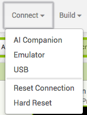

## Ολοκληρώνοντας

Τώρα που τελείωσες με τη διατύπωση ερωτήσεων καθώς και με τη σύνδεση οθονών, χρειάζεσαι έναν τρόπο για να πεις στον παίκτη πώς τα πήγε!

+ Δημιούργησε άλλη μια οθόνη που να ονομάζεται **ScoreScreen** με τίποτα άλλο πέρα από ένα Label σε αυτήν. Πρέπει επίσης να σύρεις το TinyDB για να έχεις πρόσβαση στο σκορ.

+ Τώρα πήγαινε στην προβολή Blocks και χρησιμοποίησε τα μπλοκ από τα τμήματα **ScoreScreen**, **Label1**, **Text**, **TinyDB1**και **Math** για να τα βάλεις μαζί:

 + Τέλος, πρόσθεσε μπλοκ στην τελευταία οθόνη ερωτημάτων έτσι ώστε να εμφανίζεται η οθόνη βαθμολογίας, αφού ο παίκτης απαντήσει στην τελευταία ερώτηση.

+ Τώρα θα πρέπει να είσαι έτοιμος να μεταβείς στο μενού **Connect** και να επιλέξεις τον εξομοιωτή (emulator) ή άλλη συσκευή σύνδεσης που έχεις ορίσει για τη δοκιμή των εφαρμογών σου (ενδεχομένως να χρειαστείς βοήθεια από έναν μέντορα εδώ!) και να δεις πώς λειτουργεί ο κώδικάς σου τώρα!

--- collapse ---
---
title: Πώς μπορώ να εγκαταστήσω την εφαρμογή μου σε τηλέφωνο ή tablet;
---

+ Μπορείς να δημιουργήσεις μια πραγματική εφαρμογή που μπορεί να εγκατασταθεί στη συσκευή σου Android χρησιμοποιώντας μία από τις επιλογές του μενού **Build**. Μπορείς είτε να κατεβάσεις απευθείας το πρόγραμμα εγκατάστασης εφαρμογών είτε να λάβεις έναν κωδικό QR που μπορείς να σαρώσεις για να κάνεις λήψη της εφαρμογής στη συσκευή σου.

--- /collapse ---

Αυτό είναι! Έχεις ένα κουίζ που θα κρατήσει σκορ σε όλες τις σελίδες του, ανεξάρτητα από το πόσες θα προσθέσεις, και θα πει στον παίκτη πώς τα πήγε στο τέλος. Ωραία δουλειά! Ρίξε μια ματιά στην επόμενη κάρτα για να πάρεις μερικές ιδέες για το τι άλλο μπορείς να κάνεις με αυτά που ξέρεις τώρα!
