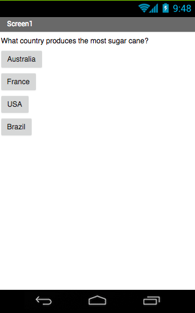

## Introduction

These cards are going to introduce you to App Inventor. You're going to get the chance to:
 * Learn to build apps for Android phones and tablets
 * Build a quiz that keeps score as the player goes through it, using any questions and answers you like
 
I'm going to do my quiz on food production around the world. If you want to follow along with me, you're welcome to. If not, then wherever I have a food production–themed question, you'll have to come up with your own question, the right answer, and some answers that sound right! If you're going to make your own quiz, have a think about that now and maybe brainstorm some ideas with the other Ninjas in your Dojo about what kind of questions you should have.

### What you will make

You'll end up with something that looks like this (though you can play around with colours and adding images to brighten it up if you like).
 

### What you will learn

+ How to use App Inventor to make Android apps
+ Adding components to the screen and changing their properties
+ Adding screens and writing code to move between them
+ Using buttons to trigger an action
+ Storing information between screens

Once you've learned these techniques, you can apply them to create more than just a quiz! These same coding tools can be used to make a complete interactive story, or to build a calculator, or a whole bunch of other cool apps.
