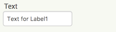
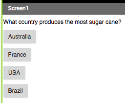

## Creating a question

+ First, drag a **Label** component into the viewer to use for your question. 

+ To make this Label have the question you want to ask in it, first select it by clicking on it either in the Viewer or the Components section. 

+ Now, in the Properties section, look for **Text** (you may have to scroll down). 

  
  
+ Change the text in the Text box to your question. I'm going to go with "What country produces the most sugar cane?", but you can pick any question you like.

Of course, what good is a question if the player doesn't have a chance to answer? Now it's time for you to add a few! 

+ Drag four **Buttons** from the Palette into the Viewer, then select each of them and change the Text in the Properties section so that one of them is the right answer and the other three are wrong answers. Be as tricky or as funny as you like with the anwers!

What you end up with should look a little like this: 

The answer to my question is Brazil, by the way! You can read more here: [dojo.soy/world-sugar](http://dojo.soy/world-sugar){:target="_blank"}
