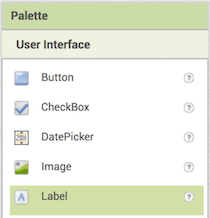
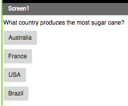

## Creating a question

+ First, drag a **Label** component into the viewer to use for your question. 

+ To make this **Label** have the question you want to ask in it first select it by clicking on it, either in the **Viewer** or the **Components** section. 

+ Now, in the **Properties** section, look for **Text** (you may have to scroll down). 

  
  
+ Change the text in the **Text** box to your question. I'm going to go with `What breed is the world's largest dog?` but you can pick any question you like. Maybe ask what the first song a band released was, or the score in the last World Cup final!

Of course, what good is a question if the player doesn't have a chance to answer? Now it's time for you to add a few! 

+ Drag four **Buttons** from the **Palette** into the **Viewer**, then select each of them and change the **Text** in the **Properties** section so that one of them is the right answer and the other three are wrong answers. Be as tricky, or as funny, as you like with them!

What you end up with should look a little like this: 

It's a Great Dane, by the way! Check him out: [dojo.soy/big-dog](http://dojo.soy/big-dog)