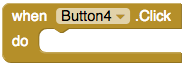

## Checking answers

Android apps are made of **Screens**. You've created your first question on one **Screen** and you're going to want to add more. You'll put them on new screens, but you need a way of keeping score between those screens. On this card, you'll be adding a **TinyDB** database to keep the score in, and some code to mark the right answer!

+ First, in the **Palette** under **Storage** find the **TinyDB** component and drag it on to the **Viewer**. You won't see anything new there, but **TinyDB1** should appear in the **Components** section. 

Now it's time to start putting together the code that will power your quiz! 

+ In the top right of the screen, click on the **Blocks** button to access the blocks view.

Just like the previous **Designer** screen, this **Blocks** screen has sections:  
  **Blocks**—where you pick code blocks
  **Viewer**—where you drag your code blocks to assemble them

There are lots of kinds of code blocks, but you're just going to need a few of them for now. 

+ In the **Blocks** section, click on whichever button matches the right answer to your question. For me, it was **Button1**. Grab the `When Button1.Click do` block and drag it onto the viewer.

+ Now click on **TinyDB1** and choose the `call TinyDB1.StoreValue` block. Drag it into the last block and then go to the **Built-in** blocks grab the pieces from **Math** and **Text** to make it look like this:
  

+ Finally, update the text value to `score` and the number to `1`, like this:
  

What you've done is stored the value `1` (as in one point for a right answer) under the label `score` in the **TinyDB** database. You can pull it back out and change it on later screens. This way, you can keep score throughout the app, no matter how many questions you add!