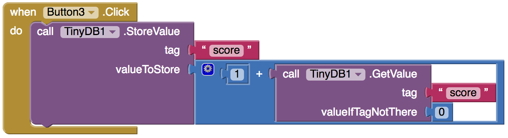

## Multiple questions

Now you've got your first question and you're giving the player a point for a right answer. 

+ To add another question, you'll need to switch back to **Designer** view and click on the **Add Screen...** button in the top menu bar.

+ Name your new screen whatever you like. I decided to be unimaginative and leave it as `Screen2` for now!

+ Your new screen will be blank. Add a **Label** with your next question and four **Buttons** with answers, just like on the last screen. Drag a **TinyDB** on too so you can get that score value you stored! I've asked what dogs are most closely related to (it's wolves!) but you pick whatever works for the quiz you're writing.

+ In this case, my right answer was on `Button3` but the code to change the score has to be a little cleverer here, since you've first got to **get** the value of `score` before you can add `1` to it and **store** it. Also, since there will only be a value there if the player got the right answer on the last screen, you need to set a default value if there's nothing there. 

+ So add some code in the **Blocks** view that looks like this (remember to use the right **Button** for your right answer!):

Great! But how do players get from `Screen1` to `Screen2`? You need to go back to `Screen1` and give them a way! 

+ To switch screens click on the `Screen2` button and pick `Screen1` from the drop-down menu.

+ Now, from the **Built-in** blocks, take the `open another screen screenName` **Control** block and a **Text** block and add them below the score code, like this (if you've changed your screen name, you'll need to use that where I've used `Screen2`):

Of course, that only works if `Button1` is clicked. 

+ You need to add a simpler block for all the other buttons (the wrong answers) like this:

By creating more screens, and adding these same kinds of blocks that point to the next screen each time, you can create an endless number of questions, and keep score throughout! 

+ Go make one or two more question screens following the steps on this card.
