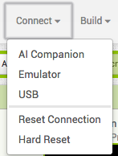

## Wrapping up

Now that you're finished adding questions and connecting screens, you need a way to tell the player how they did!

+ Create one more screen called **ScoreScreen** with nothing but a Label on it. You also need to drag the TinyDB on so you can access the score.

+ Now switch to the Blocks view and use blocks from the **ScoreScreen**, **Label1**, **Text**, **TinyDB1**, and **Math** sections to put this together:

+ You should now be able to go to the **Connect** menu and choose the emulator or other connection device you set up for testing your apps (you might need a mentor's help here!) and see how your code works right now!

   

--- collapse ---
---
title: How can I install my app on a phone or tablet?
---

+ You can build a real app that can be installed on your Android device using one of the options from the **Build** menu. You can either download the app installer directly, or get a QR code that you can scan to download the app onto your device.

  

--- /collapse ---

That's it! You've got a quiz that will keep score across all its pages, no matter how many you add, and will tell the player how they did at the end. Nice work! Check out the next card for a few ideas on what else you can do with what you know now!
