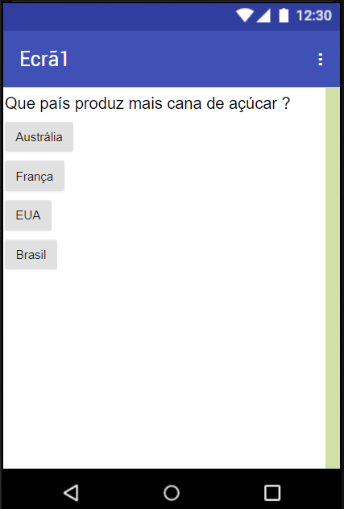

## Introdução

Estes cartões vão apresentar-te o App Inventor. Terás a oportunidade de:
 * Aprender a criar aplicações para telemóveis Android e tablets
 * Construir um questionário que guarda a pontuação à medida que o jogador o realiza, utilizando quaisquer perguntas e respostas à tua escolha

Vou fazer o meu questionário baseado na produção de alimentos pelo mundo. Se quiseres acompanhar-me, és mais que bem-vindo. Caso contrário, sempre que eu tiver uma pergunta sobre a produção alimentar, terás de inventar a tua própria pergunta, a resposta certa e algumas respostas que soem bem! Se vais fazer o teu próprio questionário, reserva um tempo agora para pensar e talvez fazer um debate de ideias com outros Ninjas do teu Dojo sobre que tipo de perguntas deves ter.

### O que vais fazer

O resultado será algo parecido com isto (embora possas brincar com as cores e adicionar imagens para abrilhantar se quiseres).

--- collapse ---
---
title: O que vais aprender
---

+ Como usar o App Inventor para criar aplicações para Android
+ Adicionar componentes ao ecrã e mudar as suas propriedades
+ Acrescentar telas e escrever código para alternar entre eles
+ Usar botões para desencadear uma ação
+ Armazenar informação entre ecrãs

--- /collapse ---

--- collapse ---
---
title: O que vais precisar
---

### Equipamento

+ Um computador capaz de aceder ao App Inventor

+ Conexão à Internet

**Opcional:**

+ Um telemóvel Android ou tablet

--- /collapse ---

Assim que aprenderes estas técnicas, podes aplicá-las para criar mais do que apenas um questionário! Estas ferramentas de código podem ser usadas para criar uma história interativa completa, ou construir uma calculadora, ou até mesmo uma série de outras aplicações fixes.