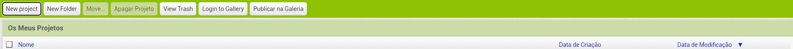
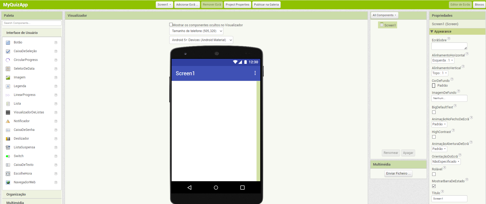

## Preparação

Antes de tudo, vais precisar de uma conta no website do App Inventor.

+ Vai para [dojo.soy/appinv-start](http://dojo.soy/appinv-start){:target="_blank"} e clica no botão **Create apps!** no canto superior direito do ecrã.

O website vai pedir-te para iniciares sessão com uma conta Google. Se não tiveres uma conta, vais precisar de criar uma ou usar uma conta dos teus pais/encarregado de educação.

Assim que iniciares sessão com uma conta Google, o App Inventor vai mostrar-te duas opções, podes configurar um dispositivo Android (telemóvel ou tablet) ou um emulador (uma simulação de um dispositivo Android) no teu computador.

--- collapse ---
---
title: Que opção devo escolher?
---

**Talvez precises de um mentor do teu Dojo para ajudar-te neste passo!**

Dependendo do que tiveres contigo ou o que está disponível no teu Dojo, poderás precisar de instalar o emulador, ou configurar o teu próprio dispositivo ou um dispositivo do Dojo, ou não fazer nada se o Dojo já tiver dispositivos configurados.

Se for preciso fazer um desses tipos de configuração, clica no link apropriado e segue as instruções da equipa do App Inventor. Assim que terminares este passo, volta para as Sushi Cards.

--- /collapse ---

Pois bem! Agora que estás pronto, é hora de criar a tua primeira aplicação para Android.

+ Volta para o App Inventor no teu navegador e clica no botão **Iniciar novo projeto** no canto superior esquerdo do teu ecrã.

+ Chama o teu projeto de `MyQuizApp` e clica em **OK**.

Irás ver um ecrã como este, o que significa que estás pronto para programar!

É possível ver que a página **Editor de Ecrãs** do App Inventor está dividida em quatro secções principais:
 + **Paleta**, onde podes escolher os componentes que vais usar para criar a tua aplicação
 + **Visualizador**, onde podes ver a aplicação que estás a trabalhar, alterá-la ou selecionar componentes
 + **Multimédia**, onde podes ver a lista dos componentes da tua aplicação e as relações entre eles
 + **Propriedades**, onde vês e alteras as propriedades dos componentes que selecionaste no momento

Existem outros botões e até outra página, mas estas quatro secções são as que irás usar por agora.

