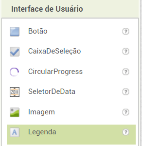
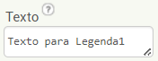
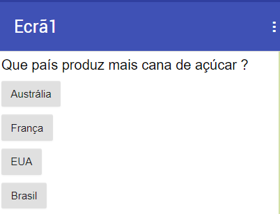

## Criar uma pergunta

+ Primeiro, arrasta o componente **Legenda** para o visualizador para usá-lo na tua pergunta.

+ Para que a legenda contenha a tua pergunta, precisas primeiro selecioná-la com um clique, seja no visualizador, seja na secção de multimédia.

+ Agora, na secção das propriedades, procura por **Texto** (poderás ter de rolar para baixo).

+ Altera o conteúdo da caixa texto para a pergunta. Eu vou optar por "Que país produz mais cana de açúcar?", mas tu podes escrever a pergunta que quiseres.

Claro que, de que serve uma pergunta se o jogador não tem hipótese de responder? Agora está na altura de adicionares algumas!

+ Arrasta quatro **Botão** da paleta para o visualizador, de seguida seleciona cada um deles e altera o texto na secção das propriedades, para que um deles seja a resposta certa e os outros três as erradas. Sê tão astuto ou engraçado quanto quiseres com as tuas respostas!

O resultado deve ser algo deste género:

Já agora, a resposta à minha pergunta é o Brasil! Podes ler mais aqui: [dojo.soy/world-sugar](http://dojo.soy/world-sugar){:target="_blank"}
