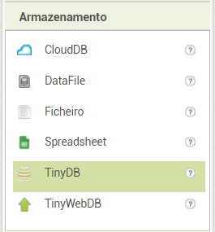
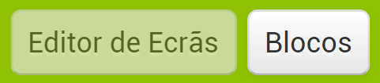
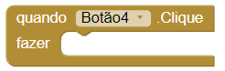
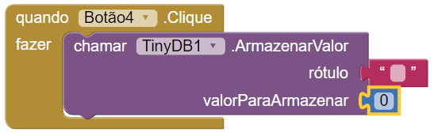
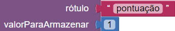

## Verificar respostas

As aplicações para Android são feitas de **Ecrãs**. Criaste a tua primeira pergunta num ecrã, e vais querer adicionar mais. Irás pôr as próximas perguntas em novos ecrãs, mas vais precisar de uma maneira de manter a pontuação entre esses ecrãs. Neste cartão, vais adicionar uma base de dados **TinyDB** para armazenar a pontuação e algum código para marcar a resposta correta!

+ Primeiro, na secção da paleta debaixo do **Armazenamento**, encontra o componente tinyDB e arrasta-o para dentro do visualizador. Não vai aparecer nada de novo lá, mas a **TinyDB1** deve aparecer na secção multimédia.

Está na altura de começar a montar o código que vai impulsionar o teu questionário!

+ Clica no botão **Blocos** para acederes à página de blocos, no canto superior direito do teu ecrã.

Esta página de blocos, tal como a página anterior do editor de ecrãs, tem secções: **Blocos** — onde escolhes os blocos de código **Visualizador** — onde arrastas os teus blocos de código para os montar

Existem diversos tipos de blocos de código — por enquanto só vais precisar de alguns.

+ Nesta secção de blocos, clica no botão que contém a resposta correta à tua pergunta. Para mim, é o **Botão4**. Agarra o bloco `quando Botão4.Clique fazer` e arrasta-o para o visualizador.

+ De seguida clica na tinyDB1 e escolhe o bloco `chamar TinyDB1.ArmazenarValor`. Arrasta-o para dentro do último bloco, escolhe a **Matemática** e o **Texto** dos blocos **Internos**, anexa-os para se parecer com isto:

+ Por fim, altera o valor do texto para `pontuação` e o número para `1`, assim:

O que acabaste de fazer foi armazenar o valor `1` (como um ponto para a resposta certa) sob a legenda `pontuação` na base de dados TinyDB. Vais poder retirá-lo e alterá-lo mais para a frente. Desta forma, podes acompanhar a pontuação no decorrer da aplicação, por mais perguntas que adiciones!
