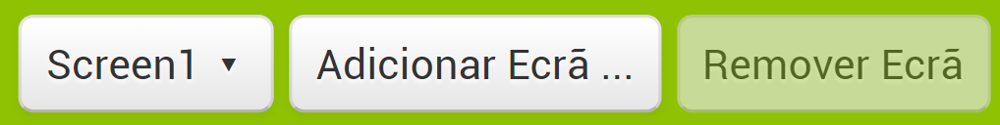
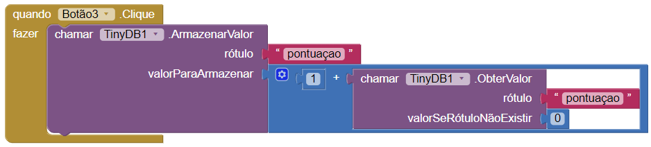
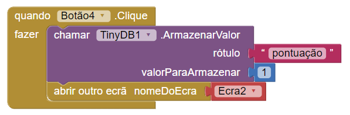
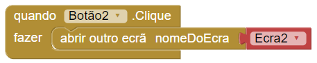

## Várias perguntas

Agora que fizeste a tua primeira pergunta e consegues atribuir um ponto ao jogador pela resposta certa.

+ Para adicionar outra pergunta, vais precisar de voltar para a página editor de ecrãs e clicar no botão **Adicionar ecrã...** na barra do menu superior.

+ Dá o nome que quiseres ao teu ecrã novo. Eu decidi ser aborrecido e deixar como **Ecrã2** por enquanto!

+ O teu novo ecrã estará em branco. Adiciona uma legenda com a tua próxima pergunta e quatro botões com respostas, tal e qual como fizeste no ecrã anterior. Arrasta a TinyDB também, para conseguires armazenar esse valor na pontuação! Eu perguntei que país produz mais arroz (é a Índia!), mas escolhe o que for mais adequado para o questionário que estás a escrever.

+ Na página de blocos, adiciona código semelhante ao seguinte. Lembra-te de usar o botão certo para a resposta certa (o meu está no botão3)!:

--- collapse ---
---
title: Porque o código é diferente desta vez?
---

O código que altera a pontuação tem que ser mais inteligente desta vez, já que tens que **obter** o valor da `pontuação` antes que possas adicionar `1` e **armazenar** esse valor.

E como só haverá um valor se o jogador acertar a resposta no ecrã anterior, tens de definir um valor padrão se não houver nada lá.

--- /collapse ---

Ótimo! Mas como é que os jogadores passam do Ecrã1 para o Ecrã2? Precisas de voltar para o Ecrã1 e dar-lhes rumo!

+ Para trocar de ecrãs, clica no botão Ecrã2 e escolhe o Ecrã1 do menu lista.

+ Agora, dos blocos Internos, tira o `abrir outro ecra nomeDoEcra` dos blocos do **Controle** e um bloco de texto, adiciona-os por baixo do código da pontuação, desta forma (se mudaste o nome do teu ecrã, vais precisar de usá-lo em vez do Ecrã2 que eu usei):

Claro que, só funciona se o botão1 for clicado.

+ Precisas de adicionar um bloco mais simples para todos os outros botões (as repostas erradas), desta forma:

Ao criar mais ecrãs, e ao adicionar este tipo de blocos que apontam para o próximo ecrã de cada vez, podes criar imensas perguntas e manter a pontuação o tempo todo!

+ Faz mais um ou dois ecrãs de perguntas seguindo os passos deste cartão.
