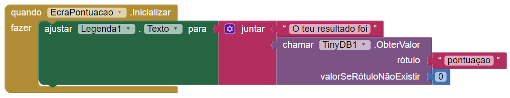
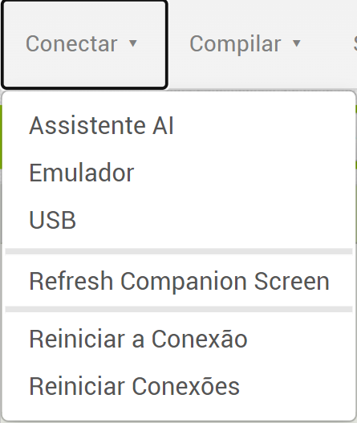
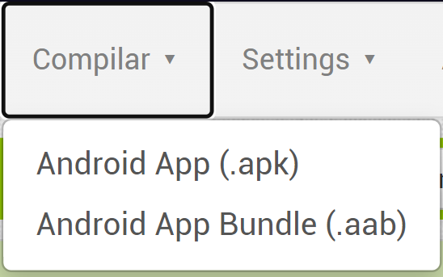

## Para concluir

Agora que acabaste de adicionar as perguntas e conectar os ecrãs, precisas de arranjar maneira de dizer ao jogador como se saiu!

+ Cria mais um ecrã com o nome **EcrãPontuação** com nada mais além de uma legenda. Precisas também de arrastar uma TinyDB para conseguires aceder a pontuação armazenada.

+ Agora muda para a página de Blocos e usa os blocos do **EcrãPontuação**, das secções **legenda1**, **texto**, **TinyDB1** e **Matematica** para construir isto:

 + Por fim, adiciona os blocos ao ecrã da tua última pergunta para que o ecrã da pontuação apareça após o jogador responder à última pergunta.

+ Agora deves ser capaz de ir ao menu **Conectar** e escolher o emulador ou outro dispositivo de conexão que configuraste para testar a tua aplicação (poderás precisar de ajuda do teu mentor aqui!) e observa como o teu código funciona!

--- collapse ---
---
title: Como posso instalar a minha aplicação num telemóvel ou tablet?
---

+ Podes construir uma aplicação real que é instalada no teu dispositivo Android onde usas uma das opções do menu **Compilar**. Podes baixar diretamente o instalador da aplicação, ou obter um código QR que pode ser digitalizado para instalar a aplicação no teu dispositivo.

--- /collapse ---

Está feito! Tens um questionário que mantém a pontuação por todas as páginas, não importa quantas mais adiciones, e vai informar ao jogador como ficou o resultado no final. Bom trabalho! Confere o próximo cartão para mais algumas ideias sobre o que podes fazer mais com o que já sabes até agora!
